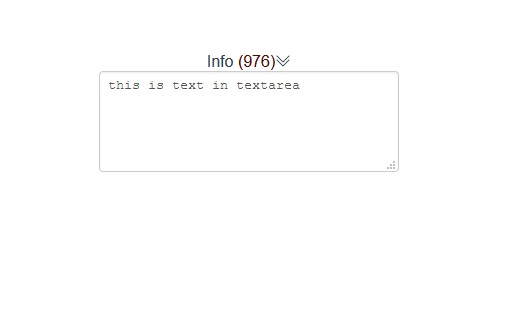

# textarea with count

#### Vue.js 3

```html

<text-input
        label="Info"
        text="value in textarea"
        maxlength="1000"
        textName="area-name"
        cols="60" rows="4">
</text-input>

```

